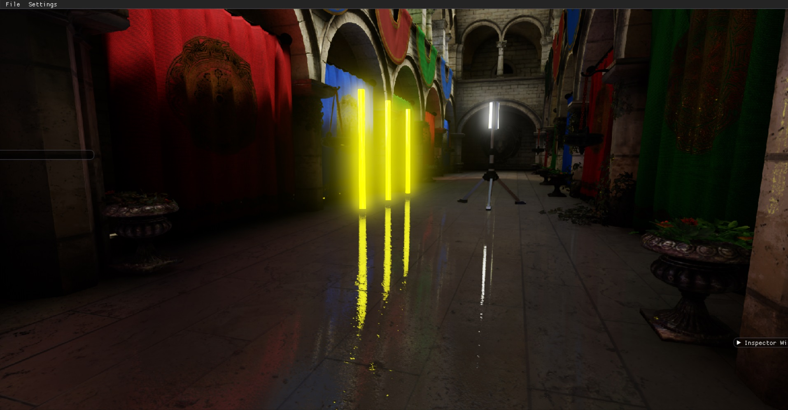
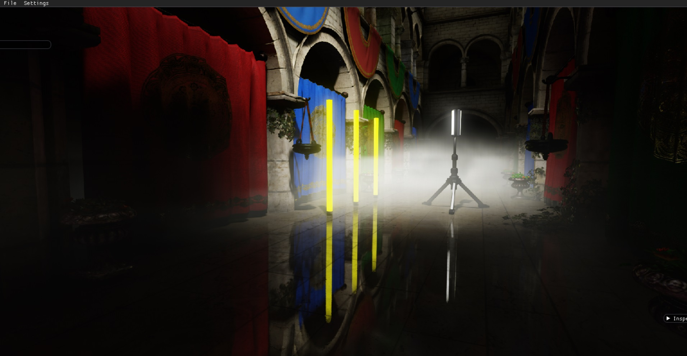
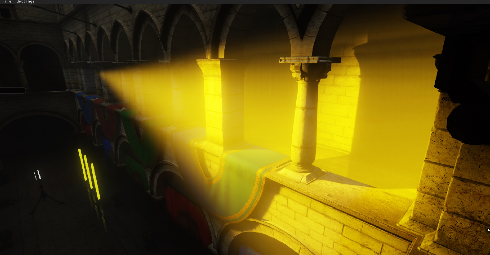

### 这个项目主要用来验证一些现代游戏引擎渲染技术。
****
  
Deferred/Forward+  
StaticMesh、SkinnedMesh  
PBR  
DirectLighting: Sun、Point、Spot、IES  
IndirectLighting: Lightmap、SHLighting、IBL   
ComputeShader PostProcessing: SSDO、SSR、BLOOM、AutoExposure、tonemaping、TAA  

编译依赖：  
netcore2.2 sdk  
Veldrid

[DEMO下载](https://share.weiyun.com/5rnysAY)

 
  
  
  
  

